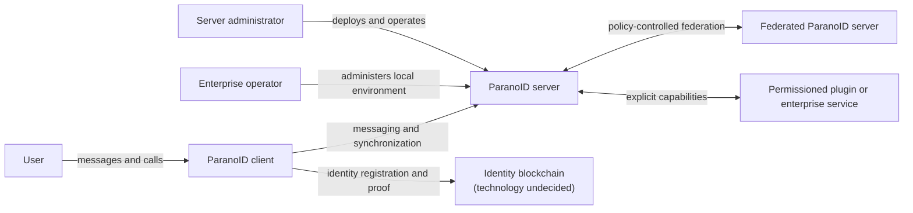

# Architecture map

ParanoID uses the C4 model for durable architecture views. Diagrams are maps,
not decisions; every important choice shown in a diagram must link to an accepted
ADR or be marked as proposed.

## Planned views

| View | Purpose | Current state |
| --- | --- | --- |
| System context | People, external systems, and trust boundaries | Conceptual draft below |
| Containers | Deployable applications and data stores | Not defined |
| Components | Internals of a container where the detail adds value | Not defined |
| Dynamic | Identity, message, federation, recovery, and call flows | Not defined |
| Deployment | Home, managed, enterprise LAN, and federated topologies | Not defined |

## Conceptual system context

This diagram records scope only. It deliberately avoids choosing a stack,
protocol, chain, or cryptographic construction.



## Proposed private-alpha deployment view

```text
OPPO A/B (Olm keys + encrypted client state)
  -> direct pinned IP TLS :38443 -> Rust server (closed-alpha-v0)
  -> private Unix socket -> dedicated PG16 cluster / ciphertext + metadata
systemd user unit -> Python supervisor -> server + private PG16
operator -> verified release pointer / restricted dumps + isolated restore DB
neighboring Nginx :80/:443 and existing PG: no connection or modification
```

This local-package view accompanies draft RFC-0009/ADR-0005, not accepted
production architecture or evidence of a hosted rollout.

## Proposed registration boundary (RFC-0010; local candidate implemented)

```text
Phone: account root + device auth keys | independent existing Olm + storage keys
  -> public request QR -> trusted maintainer verification -> local grant tool
  <- exact-key public grant QR (not a bearer, no public grant-creation API)
  -> pinned TLS + one-use signed proof -> server grant/device/mode mapping
  -> explicitly assigned existing 0/1 transport principal -> unchanged history
Phone A <-> explicitly compared contact QR/root-device-Olm binding <-> Phone B
```

[The proposal](../rfcs/0010-phone-key-registration.md) separates local identity
creation from closed-alpha admission. Public signup, blockchain and recovery
are not introduced; existing pins, keys and message state are preserved.
The [local operator/test runbook](../operations/key-registration-local.md) documents
the executable candidate. This view is not accepted production architecture or
evidence that the hosted endpoint has been migrated.

## Proposed self-service v2 server boundary

The local candidate replaces operator-dependent signup and pair routing in a
separate v2 mode. The [data-flow/trust-boundary view](../security/self-service-v2-threats.md#data-flow-and-trust-boundaries)
shows client proof, bounded ingress/challenges, serialized private PostgreSQL
transactions and offline legacy migration. It is scoped to the locking loopback
TLS binary, not public deployment or completed client architecture.
[ADR-0007](../decisions/0007-self-service-messenger.md),
[RFC-0012](../rfcs/0012-self-service-messenger.md) and the
[wire contract](../protocol/self-service-v2.md) remain drafts. Historical views
above are not self-service authority or evidence of a v2 hosted rollout.

The later [fresh-only deployment candidate](../operations/fresh-self-service-v2.md)
reuses the isolated supervisor/private PG container boundary, with explicit
reviewed IPv4:38443 TLS and one-shot replacement of only the old server data
cluster. TLS/phone state/neighbors stay outside discard. This extends the original
local-only view, not an accepted architecture or hosted rollout.

## Proposed clean-install first-contact boundary (RFC-0014)

```text
Sender: genuine recipient QR -> immutable peer/channel -> Olm PlainV1 text
  -> device-signed intro-v2 -> sealed immutable outbox -> v2 pinned-TLS transport
Recipient: zero contacts -> signature/recipient/channel + transient Olm candidate
  -> exact PlainV1 + budgets -> atomic unverified dialog/plaintext/receipt snapshot
  -> immediate reply UI -> same signed channel and one shared retained Olm Account
Server: existing proof-authenticated opaque POST/GET; no content keys or directory
```

[The exact proposed contract](../protocol/first-contact-v1.md) uses clean core3/
sealed snapshot4 and rejects old client snapshots unchanged. The owner removed
historical migration/recovery from this local candidate's gate. The source/build
is not accepted architecture, current live rollout or physical-phone evidence.

## Voice component boundary (RFC-0017)

```text
Existing native identity/contact/Olm state
  -> strict call-v1/frame2 -> sealed immutable outbox -> retained opaque relay
  <- authenticated call control <- sealed ratchet/cursor commit
  -> volatile Android CallController -> explicit Call/Answer permission
  -> libwebrtc audio source/PeerConnection <-> peer DTLS-SRTP/Opus endpoint
Android microphone service/audio focus/routes -> visible lifetime + cleanup
Relay retains ciphertext/metadata; it does not terminate media keys
```

The [core](../clients/core/voice-calls.md) and
[Android](../clients/android/voice-calls.md) components implement this scoped
proposal without a server API or snapshot-shape change. Design/native/JNI
and actual direct/isolated-relay media checks pass; remaining release gates are in
[the local record](../operations/voice-calls-local.md). No live relay topology
or permanent production architecture is accepted by this diagram.

## Proposed iOS client boundary (RFC-0021; ADR-0014 proposed)

```text
SwiftUI app (clients/ios/App) -> ParanoidKit (storage, TLS, transport, calls, UI model)
  -> C-ABI staticlib clients/ios/bridge -> paranoid-client-core (rlib, unchanged)
  -> paranoid-key-protocol (unchanged)
Keychain (AfterFirstUnlockThisDeviceOnly) + Data Protection file
  -> AES-256-GCM sealed core snapshot -> install marker (reinstall = new ID)
URLSession + Security.framework leaf-SPKI pin (the same pin Android carries)
  -> pinned-IP TLS :38443 -> self-service v2 router (server unchanged)
WebRTC.xcframework 150.7871.01 <-> peer DTLS-SRTP; call-v2 audio + camera video
  -> relay only through /v2/voice/turn; no STUN, no third-party discovery
Foreground-only: no APNs/PushKit, no background refresh, no CallKit (push = track B)
```

A second client on the existing contracts: no server change, no core change, no
new key material format and no new trust anchor. This view exists because
[CONTRIBUTING](../../CONTRIBUTING.md) requires an RFC, an ADR, a C4 view and a
current-state update for an architecture or foundational-dependency change. The
boundary is enforced by a gate that rejects any committed path outside
`clients/ios/**`, `docs/**`, `README.md`, `CHANGELOG.md` and the client
workflow, and any path inside `server/`, `clients/core/src/`,
`clients/android/`, `key-protocol/` or `deploy/`. The call contract is
[call-v2](../protocol/call-v2.md), not voice v1: two media sections, audio then
video, both `a=sendrecv`, H.264 or VP8 mandatory, no renegotiation, and a
9000-byte client cap below the measured 10040-byte frame ceiling.

[RFC-0021](../rfcs/0021-ios-client.md) and
[ADR-0014](../decisions/0014-ios-client.md) are `proposed`, not accepted. Two
simulators have completed calls in both directions on a local stand; on
2026-09-13 a signed build on a physical iPhone registered, paired by camera,
exchanged text and placed a call on that stand, and one registration from the
phone on the hosted alpha paired the owner's Android and sent a text the
server accepted; on 2026-09-14 an unscheduled session with the owner carried
text both ways with his Android and one call he placed to the iPhone, with
both cameras on. App Transport Security is off (`NSAllowsArbitraryLoads`)
because it refused the self-signed leaf on a public IP before the pinning
delegate ran; the pin above stays the only trust decision. The joint tests
with the owner are only partly run, and what that session covered is the
contributor's report, `SHOWN (joint, reported)` rather than a capture, with no
owner "go" permalink because it was unscheduled. This view is a map of
a candidate, not accepted architecture or evidence of a delivered client — the
honest status of every requirement is
[the iOS verification table](../clients/ios/verification.md), and the platform
boundaries it adds are [the iOS trust delta](../security/ios-client-threats.md).

## Rules for diagrams

- State scope, audience, and abstraction level.
- Label every relationship with intent or data flow.
- Show trust boundaries and external dependencies.
- Do not mix context, container, component, and code levels.
- Prefer a small number of useful views over diagrams that mirror every class.
- Update a diagram in the same change that alters the architecture it represents.

## Overnight realtime candidate

[Retained-stack realtime proposal](../rfcs/0015-overnight-realtime.md) records the current private-alpha scope and its exact review/test gates.
No permanent architecture acceptance or physical-phone result is implied.

## One-host coordinated voice installation

[REQ-DEPLOY-003](../operations/voice-single-host.md) records the owner-selected
single existing host and one installer across messaging/private PostgreSQL/relay.
The coordinator and its cross-user deployment boundary remain proposed under
[RFC-0018](../rfcs/0018-voice-turn.md); mandatory runtime tests and independent
review gate any exposure. Existing message TLS/data/identity and neighbors remain
protected; this is not permanent stack/architecture acceptance.
