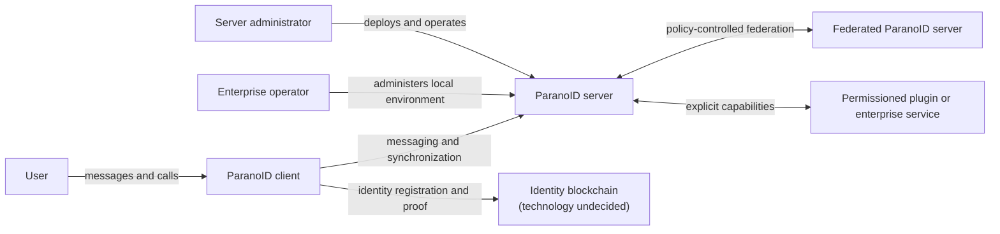

# Architecture map

ParanoID uses the C4 model for durable architecture views. Diagrams are maps,
not decisions; every important choice shown in a diagram must link to an accepted
ADR or be marked as proposed.

## Planned views

| View | Purpose | Current state |
| --- | --- | --- |
| System context | People, external systems, and trust boundaries | Conceptual draft below |
| Containers | Deployable applications and data stores | Not defined |
| Components | Internals of a container where the detail adds value | Not defined |
| Dynamic | Identity, message, federation, recovery, and call flows | Not defined |
| Deployment | Home, managed, enterprise LAN, and federated topologies | Not defined |

## Conceptual system context

This diagram records scope only. It deliberately avoids choosing a stack,
protocol, chain, or cryptographic construction.

## Rules for diagrams

- State scope, audience, and abstraction level.
- Label every relationship with intent or data flow.
- Show trust boundaries and external dependencies.
- Do not mix context, container, component, and code levels.
- Prefer a small number of useful views over diagrams that mirror every class.
- Update a diagram in the same change that alters the architecture it represents.
