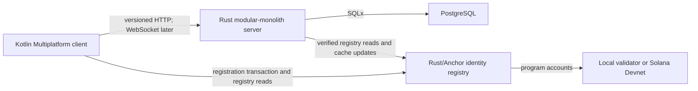

# RFC-0001: Initial technology stack and repository layout

## Summary

ParanoID will begin as a modular monolith with a Rust server, PostgreSQL,
Kotlin Multiplatform mobile clients, and a Rust-based Solana identity-registry
program. HTTP APIs will be described with OpenAPI. WebSocket transport will be
introduced when the messaging vertical slice requires it.

This RFC selects implementation foundations. It does not define the identity,
messaging, federation, encryption, token, or plugin protocols.

## Motivation

The first vertical slice must implement security-sensitive identity behavior
without locking the project into the legacy prototype. The stack must support:

- phone-number-free and email-free identity (`REQ-ID-001`);
- seed-only recovery (`REQ-ID-002`);
- blockchain-anchored nicknames (`REQ-ID-003`);
- Android and iOS clients (`REQ-CLIENT-001`);
- self-hosting on modest infrastructure (`REQ-DEPLOY-001`);
- future real-time messaging, federation, media, and extensions;
- traceable contracts and deterministic security test vectors.

## Goals and non-goals

### Goals

- Select the primary server, mobile, persistence, and Solana program stacks.
- Keep the first deployment operationally simple.
- Establish boundaries that permit later replacement through versioned
  contracts.
- Share security-critical reference behavior and test vectors across clients
  and servers.
- Provide an initial repository layout for implementation work.

### Non-goals

- Selecting cryptographic algorithms or a key-derivation construction.
- Defining public API endpoints or wire formats.
- Selecting an end-to-end encryption or federation protocol.
- Creating the PARA token or any tokenomics.
- Selecting production infrastructure providers.
- Claiming that any production capability is implemented.

## Proposed design

### Server

The first ParanoID server will be a Rust modular monolith using:

- Tokio as the asynchronous runtime;
- Axum and Tower for HTTP routing and middleware;
- PostgreSQL for durable server-owned state;
- SQLx for database access and migrations;
- structured tracing and metrics behind privacy-safe interfaces.

The server will be separated into internal modules with explicit contracts, but
will deploy as one application until measured scaling or isolation requirements
justify another process boundary. Redis, a message broker, and independently
deployed microservices are excluded from the initial baseline.

### Mobile clients

Android and iOS clients will use Kotlin Multiplatform. Compose Multiplatform is
the default shared UI framework, with platform-specific Kotlin, Swift, UIKit,
SwiftUI, Keychain, Keystore, notification, background-execution, media, and call
integrations where platform fidelity or security requires them.

The first mobile spike must prove secure-key storage, lifecycle behavior,
background restrictions, accessibility, and release tooling on physical Android
and iOS devices. Shared UI is a default, not a prohibition on native screens.

### Identity reference implementation

A Rust `identity-core` crate will provide the normative reference behavior and
test-vector generator for key hierarchy, signed envelopes, and identity-state
validation once RFC-0002 selects those contracts.

Whether mobile applications call that crate through a native binding or implement
the contract independently against the same conformance vectors remains a
required experiment. No unreviewed foreign-function boundary is accepted by this
RFC.

### Solana program

The proposed blockchain identity registry will be implemented in Rust using the
Anchor framework for the initial prototype. The program, account model, upgrade
authority, and mainnet deployment remain subject to RFC-0002 and a later ADR.

Local development and deterministic integration tests will use
`solana-test-validator`. Shared integration will use Solana Devnet. The initial
system will not operate a Solana validator or RPC node and will not require a
PARA token.

### Contracts and transport

- Applicable HTTP APIs will be contract-first and described with OpenAPI.
- WebSocket frames and other events will use explicit versioned schemas before
  implementation.
- Public contracts will define canonical encoding, limits, errors, idempotency,
  replay behavior, and compatibility.
- Database migrations will be versioned and tested for forward and rollback
  behavior where rollback is safe.

### Initial repository layout

```text
apps/
  mobile/                    Kotlin Multiplatform Android/iOS application
crates/
  identity-core/             Rust identity reference implementation
programs/
  identity-registry/         Solana/Anchor program
services/
  server/                    Rust modular-monolith server
specs/
  api/                       OpenAPI sources
  protocol/                  Versioned schemas and test vectors
tests/
  conformance/               Cross-implementation contract tests
deploy/
  compose/                   Supported self-hosted deployment artifacts
```

Directories are created when their first real artifact exists. Empty scaffolding
is not evidence of implementation.

### Conceptual deployment boundary



## Alternatives

### TypeScript server and React Native client

This is the shortest path from the legacy prototype and has a broad package
ecosystem. It was not selected because the project would still require Rust for
Solana, security-critical behavior would span more dynamic runtime boundaries,
and the legacy implementation is not a foundation we need to preserve.

### Kotlin/Ktor server and Kotlin Multiplatform client

This minimizes the number of application languages and provides strong mobile
reuse. It was not selected because Rust offers a more cohesive boundary with the
Solana program and the proposed identity reference implementation. Ktor remains
a credible alternative if the Rust server spike fails its delivery or operations
targets.

### Rust server and Flutter client

Flutter provides fast shared-UI delivery and supported native bindings. It was
not selected because ParanoID is expected to depend heavily on platform-specific
background execution, secure storage, notifications, media, and call behavior.
Kotlin Multiplatform allows shared logic and UI while retaining direct Android
and iOS integration.

### Microservices from the first release

This was rejected because it adds deployment, observability, compatibility, and
failure modes before workload evidence justifies them. Module boundaries and
versioned contracts preserve a later extraction path.

## Security and privacy

- Selection of Rust does not make the system secure; cryptographic constructions
  still require explicit review, test vectors, and independent assessment.
- Unsafe Rust is prohibited in security-critical project crates unless an RFC
  identifies the need, boundary, audit method, and safer alternatives.
- Dependencies must be pinned, reviewed, scanned, and updated through a documented
  process.
- Mobile secrets must use platform security services and must never enter logs,
  analytics, crash reports, or source control.
- OpenAPI and event schemas must distinguish public identifiers from secrets and
  minimize correlatable metadata.
- The Solana program and upgrade authority require independent threat analysis
  before mainnet use.

## Compatibility and migration

There is no current implementation or public contract to migrate. The legacy
prototype remains research input only.

The architecture deliberately places public behavior behind schemas and
conformance tests. Replacing a selected component later requires a superseding
RFC/ADR and proof that supported contracts, stored data, and operational rollback
remain valid.

## Operations and observability

- The first server remains a single deployable application plus PostgreSQL.
- Local development will use reproducible containers for external services.
- Production-like deployment must define resource limits, health checks,
  privacy-safe logs and metrics, backups, restore tests, upgrades, and rollback.
- Solana RPC endpoints are external dependencies with explicit timeout, retry,
  consistency, and degraded-mode behavior.
- The existing live Hetzner host is not changed by this RFC.

## Validation plan

1. Build a minimal Rust health service and PostgreSQL migration in CI.
2. Measure cold-start time, idle memory, request latency, and container size.
3. Build Android and iOS applications from the same Kotlin Multiplatform project.
4. Prove secure device-key creation and signing on physical Android and iOS
   devices.
5. Run an Anchor registry prototype against `solana-test-validator` and Devnet.
6. Run the same identity conformance vectors against every implementation.
7. Verify a clean self-hosted installation, backup, restore, upgrade, and rollback
   before declaring the deployment supported.

## Open questions

- Which mobile/native binding strategy, if any, passes the identity-core spike?
  Owner: mobile and security; deadline: before mobile identity implementation.
- Which exact supported Rust, Kotlin, Compose, PostgreSQL, Solana, and Anchor
  versions are pinned? Owner: maintainers; deadline: initial scaffold PR.
- Which OpenAPI and schema-generation tools produce deterministic artifacts?
  Owner: API; deadline: before the first public endpoint.
- What measured threshold would justify extracting a server module into a
  separate process? Owner: architecture; deadline: before any extraction RFC.

## Decision and follow-up

- Resulting ADR: [ADR-0002](../decisions/0002-initial-technology-stack.md)
- Identity proposal: [RFC-0002](0002-identity-registration-authentication.md)
- Implementation issues: to be created after RFC-0002 defines the first contract.

## References

- [Axum documentation](https://docs.rs/axum/latest/axum/)
- [SQLx documentation](https://docs.rs/sqlx/latest/sqlx/)
- [Kotlin Multiplatform supported platforms](https://kotlinlang.org/docs/multiplatform/supported-platforms.html)
- [Compose Multiplatform](https://kotlinlang.org/docs/multiplatform/compose-multiplatform.html)
- [Solana core concepts](https://solana.com/docs/core)
- [Anchor documentation](https://www.anchor-lang.com/docs)
