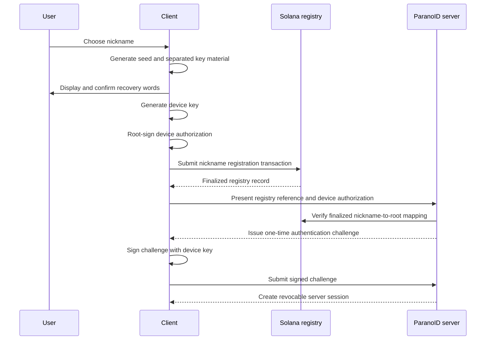

# RFC-0002: Identity, registration, and authentication

## Summary

This RFC proposes the first ParanoID vertical slice: a user generates a local
recovery seed, establishes a cryptographic account, anchors a human-readable
nickname in a Solana registry, authorizes a device, authenticates to a ParanoID
server through a signed one-time challenge, and receives a revocable server
session.

The recovery seed is the only initial recovery mechanism. Daily authentication
uses a device key rather than the recovery key. Registration and nickname state
changes require blockchain interaction; ordinary authentication does not create
a blockchain transaction.

This document is not yet an accepted identity protocol. Exact key derivation,
canonical encoding, Solana account layout, fee policy, cache validity, and token
lifetimes require experiments and review before an ADR is created.

## Motivation

The proposal addresses:

- `REQ-ID-001`: no mandatory phone number or email address;
- `REQ-ID-002`: seed-only recovery in paranoid mode;
- `REQ-ID-003`: a blockchain-anchored human-readable nickname;
- `REQ-ID-004`: sustainable registration cost and abuse controls;
- `REQ-ID-005`: separately revocable per-device authentication;
- `REQ-ID-006`: bounded authentication behavior when blockchain access is
  temporarily unavailable;
- `REQ-NET-001`: useful local-network operation without public internet;
- `REQ-MULTI-001`: a future coherent identity across multiple servers;
- `REQ-SEC-001`: defined and testable security boundaries before privacy claims.

The identity foundation must avoid using one hot key for recovery, blockchain
control, device authentication, and future messaging encryption.

## Goals and non-goals

### Goals

- Define account, recovery, registry, device, authentication, and session
  boundaries.
- Make the recovery seed sufficient to regain account control without an email,
  phone number, operator override, or custodial wallet.
- Keep recovery authority out of routine online authentication.
- Anchor a normalized nickname to cryptographic account control on Solana.
- Allow previously verified accounts and devices to authenticate during a
  temporary Solana or public-internet outage under explicit cache policy.
- Produce deterministic conformance vectors and negative security tests before
  mobile integration.
- Measure on-chain cost and abuse economics before mainnet deployment.

### Non-goals

- Message encryption, messaging keys, prekeys, groups, or calls.
- Social recovery, custodial recovery, password reset, or support override.
- PARA token creation, token payments, staking, or token-gated identity.
- Production mainnet deployment.
- Nickname marketplaces, auctions, lending, or speculative transfers.
- Complete federation or multi-server authorization semantics.
- Anonymous or unlinkable use against a global blockchain observer.

## Proposed design

### Terminology

**Recovery seed**
: Human-readable recovery words generated locally from cryptographically secure
entropy. The exact mnemonic and seed standard is pending selection.

**Account root**
: The stable public-key identity recovered from the seed. It authorizes devices
and high-impact identity changes but is not used for daily server login.

**Registry authority**
: A key isolated from daily authentication and authorized to create or update the
Solana nickname record. Its exact relation to the account root is pending the
key-derivation decision.

**Device key**
: A per-installation signing key held in platform-protected storage when the
platform permits it. A device becomes valid through a root-signed authorization.

**Device authorization**
: A versioned, canonical, root-signed statement binding a device public key,
device identifier, capabilities, issuance time, and revocation semantics to an
account.

**Home server**
: A ParanoID server with which the device establishes an authenticated session.
This RFC does not decide whether one server is globally authoritative.

### Security invariants

1. The recovery seed and private root material never leave the client device as
   protocol data.
2. The server never receives enough information to reconstruct the recovery
   seed, account root private key, registry authority private key, or device
   private key.
3. Recovery, registry, device, session, and future messaging keys are separated
   by reviewed derivation or independent generation.
4. A device cannot authorize another device without explicit root-authorized
   capability.
5. A challenge is single-use, short-lived, unpredictable, server-bound,
   purpose-bound, and protocol-version-bound.
6. A signature accepted by one ParanoID server cannot be replayed against another
   server or another operation.
7. Loss of the recovery words has no operator bypass in paranoid mode.
8. A server must not silently replace blockchain identity state with an
   unsigned local mapping.
9. A chain or RPC failure must have explicit degraded behavior and must not be
   interpreted as proof that an identity was revoked or transferred.
10. PARA token ownership is not required to create an account or authenticate in
    this version.

### Proposed key hierarchy

The first experiment will evaluate a 24-word mnemonic representing 256 bits of
entropy. Twelve-word and optional-passphrase variants remain alternatives until
recovery usability and compatibility tests are complete.

The seed must produce or protect distinct logical authorities:

```text
recovery seed
├── account root authority
├── Solana registry authority
├── recovery verification material
└── future reserved branches
    ├── messaging identity
    └── federation or plugin uses

device installation
└── independently generated device signing key
```

The exact deterministic construction is deliberately unresolved. The selected
construction must use reviewed standards, explicit domain separation, hardened
paths where applicable, and published test vectors. It must analyze interaction
with BIP-39, SLIP-0010, Solana wallet conventions, secure hardware, and future
algorithm agility. Inventing a project-specific cryptographic primitive is
prohibited.

`EXP-IDENTITY-0001` now provides a Rust-only comparison of three candidates and
a committed public vector. It confirms that the experiment is reproducible and
that the tested purposes produce distinct public keys. It does not resolve this
RFC: none of the candidates, paths, mnemonic parameters, or schema identifiers
is accepted. See the
[experiment record](../experiments/identity-key-hierarchy-0001.md) and
[public vector](../../specs/protocol/identity/key-derivation-experiment-v1.json).

The initial client should not retain plaintext recovery words after the user has
completed the recovery confirmation flow. Whether encrypted seed retention is an
optional mode is outside paranoid-mode v1 and requires a separate decision.

### Account creation flow



Before showing the seed, the client must explain that losing the words means
losing the account. Before broadcasting the transaction, it must show the public
metadata and exact network fee or sponsorship policy.

### Solana nickname registry

The registry prototype will map one canonical nickname to one account-root public
key and include enough version and status information to interpret the record.
All fields written on-chain are public, permanent or difficult to erase, and
enumerable unless a measured design proves otherwise.

The prototype must compare at least:

1. one program-derived account per nickname;
2. a shared or paged registry account;
3. a compressed or commitment-based registry with verifiable proofs.

The comparison must measure:

- creation and update lamports;
- transaction size and compute use;
- concurrent-registration conflicts;
- lookup proof complexity;
- account closure and rent recovery;
- upgrade and migration behavior;
- enumeration and metadata exposure;
- spam and founder-sponsorship cost under attack.

No mainnet account model or founder-paid registration policy is accepted until
the experiment produces repeatable cost evidence. Devnet funds and local-validator
lamports have no production economic meaning.

The registry is independent of any PARA token. A future token may pay for optional
services, but it cannot become an implicit prerequisite for identity without a
new product requirement, RFC, threat analysis, and migration plan.

### Nickname rules

Before implementation, the registry contract must specify:

- Unicode version and normalization form;
- allowed scripts, characters, length, and case behavior;
- canonical byte representation;
- display name versus unique nickname;
- confusable-character handling;
- reserved names;
- uniqueness and concurrent claims;
- renewal or permanence;
- transfer, rename, revocation, and dispute policy;
- whether the original nickname remains publicly linkable after a change.

The first experiment should use a deliberately narrow ASCII profile so that
blockchain cost and authentication can be tested without pretending the final
international naming policy is solved.

### Device authorization

The account root signs a canonical device authorization containing at least:

- protocol and authorization version;
- account-root public key;
- device public key;
- random device identifier;
- issued-at time;
- optional expiry;
- explicit capabilities;
- root-authorized sequence or epoch for revocation ordering.

The display label for a device is server-side convenience metadata and must not be
signed if it contains user-entered personal information that federation peers do
not need.

Device revocation semantics and conflict resolution remain open. A simple server
database row is insufficient for multi-server use unless all servers can verify
the signed authorization and a coherent revocation state.

### Authentication challenge

The proposed server flow is:

1. The client requests a challenge for an account, device, server, and purpose.
2. The server creates a cryptographically random nonce and stores only the state
   required to reject replay.
3. The challenge expires quickly and can be consumed only once.
4. The client verifies the displayed/expected server identity and signs the
   canonical challenge envelope with its device key.
5. The server verifies the envelope, nonce, expiry, server binding, purpose,
   protocol version, root-signed device authorization, revocation state, and
   nickname-to-root registry state.
6. On success, the challenge is consumed atomically and a session is issued.

The signed envelope must contain at least:

- protocol identifier and version;
- operation purpose;
- stable server identifier and expected origin;
- challenge identifier;
- 256-bit or stronger random nonce;
- account-root public key;
- device identifier and device public key;
- issued-at and expiration times;
- requested session capabilities;
- hash of any server policy or terms that the signature is intended to accept.

Canonical CBOR, deterministic Protobuf, and a strictly canonical JSON profile are
candidate encodings. The choice must be tested across Rust, Kotlin, and Swift
before acceptance.

### Server sessions

The initial proposal uses opaque random session credentials rather than encoding
long-lived authority into self-contained JWTs.

- Access credentials are short-lived.
- Refresh credentials rotate on use.
- Only hashed refresh credentials are stored server-side.
- Reuse of a rotated refresh credential revokes its session family.
- Sessions are scoped to one server and device.
- Device revocation invalidates associated sessions.
- Logs contain identifiers suitable for incident response but no credentials,
  recovery material, raw signatures, or unnecessary chain metadata.

Exact lifetimes, concurrent-session limits, inactivity policy, and rate limits
remain operational decisions backed by tests.

### Solana availability and local-network operation

New nickname registrations and registry-changing operations require an available
Solana RPC path and sufficient confidence in finalized chain state.

Ordinary authentication must not create a transaction. A server may authenticate
a previously verified, non-revoked device against a signed and persisted registry
snapshot during a temporary public-internet or RPC outage. The cache policy must
define:

- accepted commitment level;
- last verified slot and block identity;
- maximum stale duration by operation risk;
- behavior after observed forks or inconsistent RPC responses;
- which operations are permitted while stale;
- operator and user warnings;
- reconciliation when connectivity returns.

This degraded path is necessary for `REQ-NET-001`. A stale cache must never permit
nickname transfer, root replacement, device recovery, or another high-impact
identity change.

### Recovery

In paranoid mode, recovery requires the original words and any explicitly
selected mnemonic passphrase. No phone, email, administrator, server operator,
plugin, token balance, or customer-support procedure can substitute for them.

The recovery experiment must prove that a clean client can:

1. reconstruct the same account root and registry authority;
2. locate and validate the existing nickname record;
3. create and authorize a replacement device;
4. publish or synchronize a verifiable revocation state for the lost device;
5. authenticate without access to the previous server database, subject to the
   future multi-server design.

If any step requires server-owned secret state, seed-only recovery is not
satisfied.

### Proposed server persistence

The first prototype may use the following logical records. These are not yet a
database contract:

```text
accounts
  account_root_public_key
  canonical_nickname
  registry_program
  registry_account
  verified_slot
  registry_state_hash
  status

devices
  account_root_public_key
  device_id
  device_public_key
  signed_authorization
  authorization_version
  revoked_at

authentication_challenges
  challenge_id
  nonce_hash
  server_id
  purpose
  account_root_public_key
  device_id
  issued_at
  expires_at
  consumed_at

sessions
  session_id
  account_root_public_key
  device_id
  refresh_credential_hash
  issued_at
  expires_at
  revoked_at
```

Public API and database schemas must be specified separately before implementation.

## Alternatives

### Use the recovery/root key for every login

Rejected because it keeps the highest-value authority online, increases exposure
to compromised devices and phishing, and makes device-specific revocation
impossible.

### Require a live Solana read for every login

Rejected because it conflicts with local-network operation and turns RPC or chain
availability into a global authentication dependency. High-impact state changes
still require fresh chain verification.

### Store the nickname only in the home-server database

Rejected because it does not satisfy `REQ-ID-003` and makes identity portability
dependent on one operator.

### Use an existing wallet application as the account

Rejected as a mandatory model because ParanoID recovery and availability would
depend on a third-party wallet. External wallets may later be attached as optional
proofs through a separate RFC.

### Introduce PARA before identity registration

Rejected for the first vertical slice because token design adds financial,
regulatory, custody, abuse, and migration risks without being necessary to prove
cryptographic registration and authentication.

## Security and privacy

Priority risks include:

- seed theft through screenshots, clipboard, accessibility services, malware,
  backups, analytics, or phishing;
- device-key extraction or misuse on a compromised phone;
- malicious root-device authorization or revocation conflicts;
- challenge replay, cross-server replay, signature confusion, and canonical
  encoding differences;
- session theft and refresh-token replay;
- malicious or inconsistent RPC responses;
- blockchain reorganization or stale cache acceptance;
- nickname enumeration, correlation, confusables, squatting, and targeted fees;
- permanent linkage of nickname, account key, transaction fee payer, timing, and
  network activity;
- denial of service through challenge creation, signature verification, RPC use,
  or subsidized registration;
- compromised Solana upgrade authority or supply-chain dependencies.

The threat model is updated with preliminary mitigations. No production security,
privacy, anonymity, or recovery claim is valid while this RFC remains proposed.

## Compatibility and migration

There is no current identity contract to migrate. The legacy prototype's account,
wallet, nickname, and authentication formats are incompatible by default and will
not be imported without a separate migration RFC.

All signed structures, registry accounts, API operations, and persisted identity
records require explicit versions before implementation. The prototype may be
discarded if the experiments reject the design.

## Operations and observability

- Log challenge outcomes by non-secret correlation identifiers, not raw payloads
  or signatures.
- Measure challenge creation, verification failures, replay rejection, registry
  RPC latency, cache age, chain inconsistency, registration cost, rate-limit
  events, device authorization, revocation, and session rotation.
- Alert on anomalous challenge volume, repeated signature failures, refresh-token
  reuse, stale registry state, RPC disagreement, and sponsor-wallet depletion.
- Backups must preserve signed device and registry-cache state but do not replace
  seed recovery.
- Restores must reject expired challenges and revoked or reused sessions.
- Clock skew and server identity rotation require documented runbooks.

## Validation plan

### Deterministic tests

- mnemonic entropy to every selected public key;
- domain separation between all key purposes;
- canonical signed bytes across Rust, Kotlin, and Swift;
- stable account and device identifiers;
- Solana account addresses and serialized registry data.

### Authentication tests

- successful authorized-device login;
- wrong seed, root, device, server, origin, purpose, version, nonce, or signature;
- replay before and after session creation;
- expired, future-dated, already consumed, and concurrent challenges;
- revoked device and session-family replay;
- transaction rollback and database concurrency failures;
- clock skew and server restart;
- rate limits and resource-exhaustion behavior.

### Registry experiments

- local-validator and Devnet registration;
- repeatable lamport and compute measurements for each account model;
- concurrent nickname claims;
- RPC timeout, conflicting RPC, stale state, and reorganization simulation;
- sponsor-cost attack model;
- upgrade-authority compromise and program migration exercise.

### Recovery and device tests

- clean-device seed recovery;
- replacement-device authorization;
- lost-device revocation;
- stolen unlocked device with safe seed;
- lost seed with active device;
- server loss and restore;
- public-internet loss with a functioning local network.

### Review gates

- cross-platform conformance review;
- abuse and privacy review;
- Solana program security review before mainnet;
- independent cryptographic review before production security claims.

## Open questions

1. Which mnemonic standard, word count, languages, and optional passphrase policy
   are accepted? Owner: identity and UX; deadline: before key-generation code.
2. Which reviewed derivation construction and paths separate account, registry,
   recovery, and future messaging authority? Owner: security; deadline: before
   production identity-core implementation. `EXP-IDENTITY-0001` supplies initial
   Rust evidence but does not answer the question.
3. Is the account root Ed25519, or does algorithm agility require another
   representation? Owner: security; deadline: before signed test vectors.
4. Which canonical signed encoding passes Rust/Kotlin/Swift conformance? Owner:
   protocol; deadline: before authentication endpoints.
5. Which Solana account model meets the accepted cost and privacy threshold?
   Owner: blockchain; deadline: before the registry ADR.
6. Who pays registration fees, and how is unbounded sponsorship prevented?
   Owner: product and finance; deadline: before any mainnet beta.
7. What are the final nickname normalization, renewal, transfer, and dispute
   rules? Owner: product and protocol; deadline: before public registration.
8. How is device revocation synchronized across multiple servers without making
   every login chain-dependent? Owner: identity and federation; deadline: before
   multi-server identity implementation.
9. What cache age and finalized-state policy is acceptable for offline login?
   Owner: security and operations; deadline: before degraded-mode implementation.
10. Is encrypted local seed retention offered outside paranoid mode? Owner:
    product and security; deadline: not required for v1.

## Decision and follow-up

- Resulting ADR: none; this RFC remains proposed.
- Stack decision: [ADR-0002](../decisions/0002-initial-technology-stack.md)
- Required experiments: key hierarchy, cross-platform signing, registry cost and
  account layout, replay-safe challenge flow, and offline registry cache.
- Initial key-hierarchy evidence:
  [EXP-IDENTITY-0001](../experiments/identity-key-hierarchy-0001.md); no candidate
  is selected.
- Implementation issues: create only after the corresponding contract section is
  accepted or explicitly marked as an experiment.
