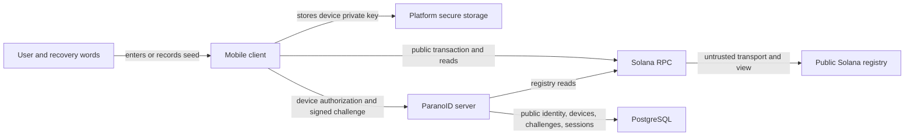

# Threat model

This is an initial discovery scaffold, not evidence that ParanoID is secure.
Update it whenever assets, actors, data flows, dependencies, or trust boundaries
change.

## Security objectives

- Prevent unauthorized control of accounts, devices, servers, names, and plugins.
- Protect message content according to a precisely defined encryption scope.
- Minimize and document metadata visible to servers, peers, chains, push services,
  hosting providers, plugins, and observers.
- Preserve authenticity and integrity across synchronization and federation.
- Remain recoverable from operational failure without inventing hidden account
  recovery that contradicts paranoid mode.
- Make security-relevant state and failures understandable to users and operators.

## Assets

- recovery seed and derived key material;
- device authorization and revocation state;
- blockchain identity and nickname control;
- message content, attachments, call media, and local caches;
- contact, group, timing, presence, and federation metadata;
- server credentials, backups, configuration, logs, and update channel;
- plugin permissions, tokens, data, and outputs;
- enterprise CRM and organizational data.

## Candidate threat actors

- opportunistic remote attacker;
- malicious or compromised server operator;
- malicious federation peer;
- malicious plugin or AI service;
- compromised client device;
- hosting, DNS, network, push-notification, or blockchain observer;
- spammer, bot operator, name squatter, or economic-abuse actor;
- insider with administrative access;
- software supply-chain attacker;
- coercive or censoring network authority.

## Trust boundaries to define

1. Recovery seed to device key derivation.
2. Device to local secure storage and operating system services.
3. Client to home server.
4. Server to federation peer.
5. Client or service to blockchain RPC and naming contracts.
6. Core system to plugin, bot, CRM, and AI services.
7. Server to database, object storage, backup, update, and observability systems.
8. Mobile client to platform push notification services.

## Proposed identity data flow

This section tracks the design proposed in
[RFC-0002](../rfcs/0002-identity-registration-authentication.md). It is not an
accepted protocol or evidence of implemented protection.

Proposed trust assumptions:

- the client operating system and secure storage can still be compromised and
  are not equivalent to an offline hardware wallet;
- the server is trusted to enforce its local authorization policy but is not
  trusted with recovery or device private keys;
- one RPC provider is not inherently trusted to provide complete or consistent
  chain state;
- the blockchain is intentionally public and exposes permanent correlation data;
- cached registry state trades freshness for local availability and cannot
  authorize high-impact changes while stale.

## Priority identity threats

| ID | Threat | Initial mitigation direction | Required verification |
| --- | --- | --- | --- |
| THR-ID-001 | Recovery words are captured through screenshots, clipboard, accessibility services, backups, analytics, malware, or phishing. | Avoid clipboard and screenshots where enforceable, never log or transmit words, confirm offline backup, minimize lifetime in memory, and provide explicit phishing-resistant UX. | Mobile adversarial tests, log and crash-report inspection, memory-lifetime review, and UX study. |
| THR-ID-002 | A stolen unlocked device authenticates as the user. | Per-device protected key, local user-presence policy, root-separated authority, remote revocation, and short revocable sessions. | Physical-device theft scenario and revocation tests. |
| THR-ID-003 | A compromised server adds a device or replaces the account mapping. | Root-signed device authorization and verification against signed/finalized registry state; no unsigned server-side replacement. | Malicious-server and database-tampering tests. |
| THR-ID-004 | A signed challenge is replayed across time, servers, origins, devices, or operations. | Random single-use nonce, atomic consumption, short expiry, server/origin/purpose/version binding, and canonical encoding. | Replay, concurrency, clock-skew, and cross-domain conformance tests. |
| THR-ID-005 | Different clients sign different bytes for the same displayed request. | Select one canonical encoding and publish byte-level Rust/Kotlin/Swift test vectors. | Cross-platform positive and negative vectors reviewed before endpoint implementation. |
| THR-ID-006 | A malicious or inconsistent RPC lies about nickname ownership or revocation. | Commitment policy, multiple-provider comparison for high-impact operations, persisted slot/block evidence, inconsistency detection, and fail-closed changes. | Conflicting RPC, stale response, fork, timeout, and recovery simulations. |
| THR-ID-007 | Offline login accepts identity state that has been transferred or revoked. | Bounded cache policy, visible stale state, operation-specific restrictions, and reconciliation before high-impact actions. | Cache-age matrix and partition-recovery tests. |
| THR-ID-008 | An attacker squats names or drains a sponsored fee payer. | Canonicalization, collision handling, rate limits, proof or payment before sponsorship, budgets, circuit breakers, and no automatic unlimited subsidy. | Concurrent-claim tests and measured economic attack model. |
| THR-ID-009 | On-chain data links a nickname, root key, fee payer, timing, IP-visible RPC activity, and future social activity. | Minimize fields, disclose metadata before registration, separate authorities, avoid unnecessary writes, and document that blockchain identity is not anonymous. | Public-data enumeration and correlation review. |
| THR-ID-010 | A session or refresh credential is stolen or replayed. | Opaque random credentials, short access lifetime, hashed refresh state, rotation, family-reuse detection, and device revocation. | Credential theft and reuse tests with audit-event verification. |
| THR-ID-011 | Key derivation reuses authority across registry, login, messaging, or another product. | Reviewed domain separation or independent generation, reserved versioned branches, and deterministic vectors. | Cryptographic review and cross-purpose key inequality tests. |
| THR-ID-012 | Solana program or upgrade authority is compromised. | Minimal program, constrained authority, reproducible builds, audited upgrade policy, monitoring, and an explicit migration path. | Program security review and upgrade-compromise exercise before mainnet. |

`EXP-IDENTITY-0001` adds reproducible public-key inequality tests relevant to
`THR-ID-011` and uses best-effort zeroization for selected Rust secret buffers.
`EXP-IDENTITY-0002` reproduces the provisional HKDF candidate on JVM and Android
host tests, rejects passphrases outside the prototype policy, and clears mutable
derived Kotlin byte arrays on a best-effort basis. It also adds Bouncy Castle as
a JVM/Android provider trust boundary and the native Apple provider path as an
unverified iOS boundary.

Neither experiment closes `THR-ID-001` or `THR-ID-011`: immutable Kotlin string
copies, complete BIP-39 validation, physical-device memory lifetime,
cross-application reuse, provider consistency, algorithm agility, and
independent cryptographic review remain required.

## Identity metadata inventory

The proposed design may expose or store:

| Observer | Candidate metadata |
| --- | --- |
| Solana and global observers | canonical nickname, account-root or registry public key, fee payer, transaction timing, program version, and change history |
| RPC provider | client or server IP, requested accounts, timing, cluster, and transaction submission |
| Home server | nickname, account root, device identifiers and keys, login timing, IP address, sessions, registry slot, and server relationships |
| Federated server | future account identifiers, device authorization evidence, routing and relationship metadata |
| Mobile platform | application installation, secure-storage access, push token, network timing, and crash diagnostics |

Every accepted registry and protocol field must identify which observers receive
it, why it is necessary, how long off-chain copies are retained, and whether the
user can understand the disclosure before registration.

## Priority discovery questions

- Which keys exist, where are they generated, and what can each key authorize?
- How are devices added, verified, rotated, revoked, and recovered?
- What happens when the blockchain or RPC provider is unavailable, reorganized,
  censored, expensive, or inconsistent?
- Which identity and relationship metadata becomes permanently public on-chain?
- Who can correlate a nickname, wallet, server, IP address, and social graph?
- Which messaging modes are end-to-end encrypted, and who are the endpoints?
- How are group membership changes authenticated and reflected in key state?
- How do federation peers limit spam, replay, enumeration, and resource exhaustion?
- Can plugins or enterprise controls access plaintext, keys, metadata, or recovery
  paths, and how is that consent represented?
- How are binaries, containers, mobile releases, and automatic updates signed and
  verified?

## Required analysis artifacts

Before the first architecture is accepted, add data-flow diagrams, STRIDE-style
threat enumeration, abuse cases, risk ratings, mitigations, residual risk owners,
and verification tests. Before release, perform independent cryptographic and
application security review appropriate to the claims being made.
