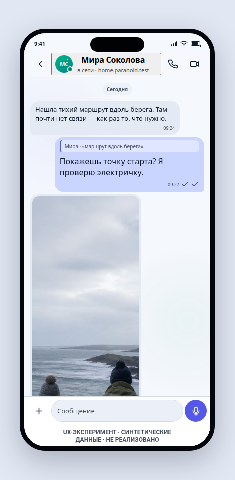
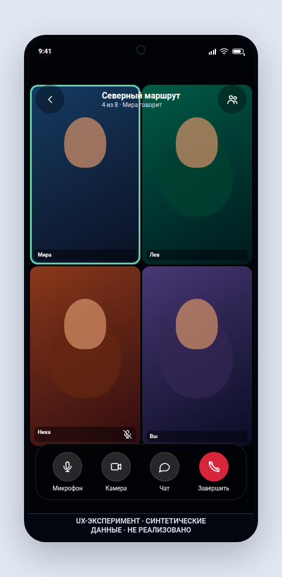
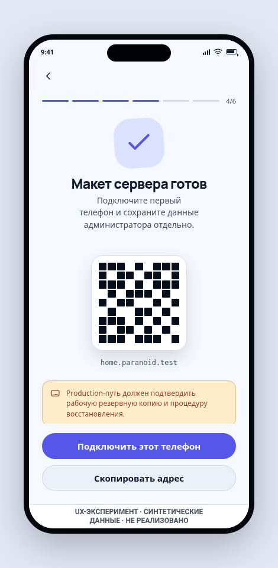
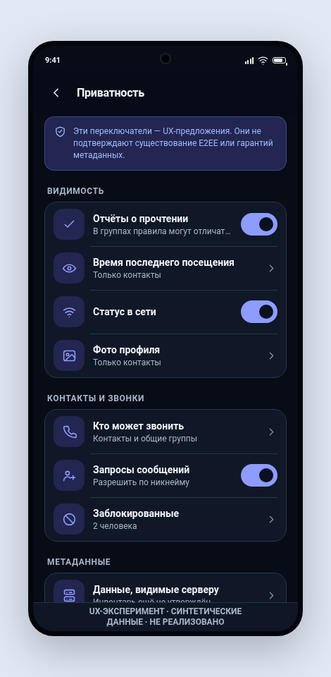

# ParanoID mobile messenger UX prototype

## Question

Can the founder direction and current draft requirements be expressed as one
coherent, understandable iOS/Android product journey before messaging, calling,
federation, and deployment contracts are accepted?

## Decision boundary

This directory is a visual and interaction experiment. It does not implement
authentication, identity registration, cryptography, messaging, federation,
calling, storage, notifications, or server deployment. It must not be used as
evidence for a production privacy, security, recovery, or availability claim.

## Linked evidence

- `REQ-ID-001` through `REQ-ID-006`
- `REQ-MSG-001`, `REQ-CALL-001`, and `REQ-CLIENT-001`
- `REQ-DEPLOY-001`, `REQ-NET-001`, `REQ-FED-001`, and `REQ-MULTI-001`
- `REQ-SEC-001`, `ADR-0002`, and proposed `RFC-0002`
- `THR-ID-001`, `THR-ID-002`, `THR-ID-007`, `THR-ID-008`, and `THR-ID-009`

## Method

The prototype uses synthetic names, messages, media, server addresses, device
records, public identifiers, and recovery-word placeholders. It models iOS and
Android visual conventions in a dependency-free web renderer so the information
architecture and interaction states can be reviewed before Compose Multiplatform
application scaffolding exists.

Every rendered phone retains an in-product `UX EXPERIMENT / SYNTHETIC DATA / NOT
IMPLEMENTED` provenance marker, including direct links, mobile layout, capture
mode, and visual-review boards. Protected-boundary screens also state their
candidate or simulated status in context; the marker is not a substitute for
those specific disclosures.

The screen inventory is in [SCREEN_MAP.md](SCREEN_MAP.md). The visual language is
defined in [the experimental design system](../../design-system/paranoid/MASTER.md).

## Run

Serve the repository root with any local static server and open:

```text
http://127.0.0.1:4173/prototypes/mobile-messenger/
```

The prototype explorer selects a screen, platform, appearance, and UI state.
Query parameters make every screen directly addressable for review. For example:

```text
?screen=chat-personal&platform=android&theme=dark
```

## Preview

| iOS light | Android dark |
| --- | --- |
|  |  |
|  |  |

## Verification

Run the dependency-free route, claim, and asset checks while the static server
is available:

```text
node --test prototypes/mobile-messenger/prototype.test.mjs
```

`browser-smoke.mjs` attaches to a local Chromium DevTools endpoint on port 9223
and verifies real clicks, navigation, platform/theme changes, and switch state.
The visual board at `review-board.html?group=0` groups every route for manual QA;
groups 0 through 7 cover all 49 screens.

## Limitations and exit criteria

This experiment is useful when maintainers can review the complete route map,
move through the critical paths, compare iOS and Android adaptations, and inspect
light/dark plus loading/empty/error/offline states. It exits into product
requirements and future RFCs only after research or founder review accepts the
relevant behavior; the prototype itself cannot accept architecture.
